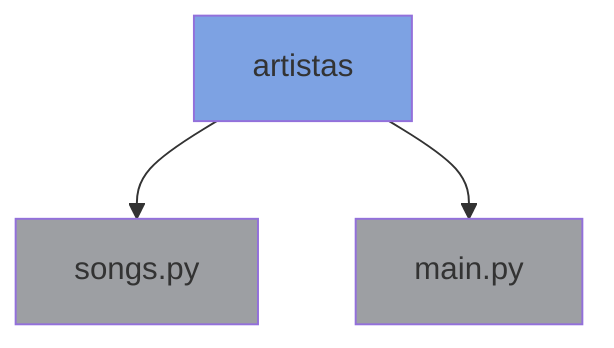
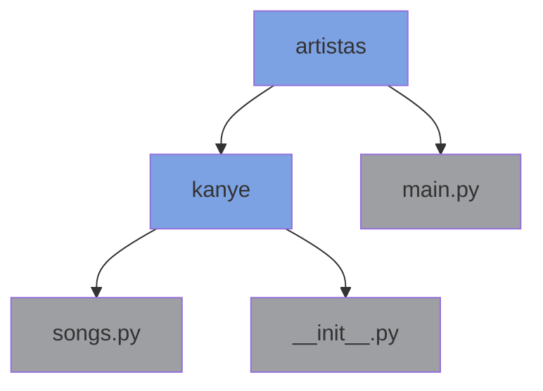
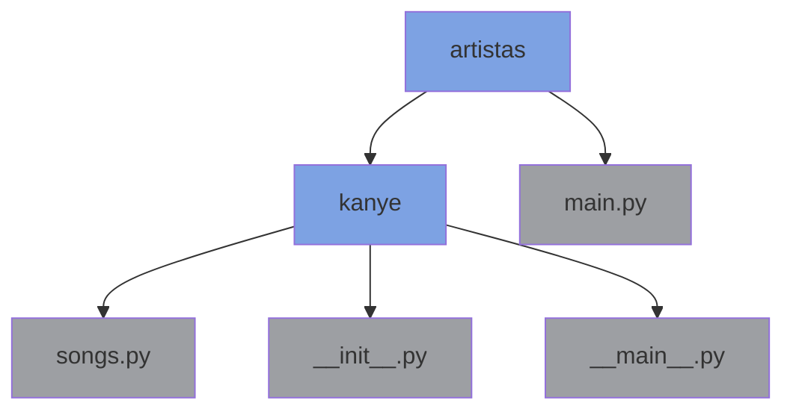

## Definindo módulos e pacotes

Da mesma maneira que importamos bibliotecas que outras pessoas fizeram para agilizar nosso trabalho, podemos definir 
uma biblioteca para melhor organizar nosso código, ou então para disponibilizá-lo para outras pessoas.

Vamos supor que queiramos criar um **módulo** `song.py`, para baixar as letras das músicas do gênio Kanye West.
Iremos usar a biblioteca _lyricsgenius_, que outra pessoa programou, para realizar a tarefa de buscar as letras na 
Internet (consulte a seção [Instalação](../README.md#instalação) para ver como instalar esta biblioteca externa na sua máquina).

Nosso arquivo `songs.py` ficará assim:

```python
import lyricsgenius as lg
import json


def get_lyrics(artist, n_songs):
    client_access_token = 'kRNWH_GrdQsfGPOIOF4wI-hUkfhLdFry-QaNw6c0D0QIFaSf1p61Qb-vyuDlUrlS'

    genius = lg.Genius(
        client_access_token,  # token de acesso do Genius Client API
        skip_non_songs=True,
        excluded_terms=["(Remix)", "(Live)"],
        remove_section_headers=True
    )

    with open("lyrics.json", "w") as some_file:  # File to write lyrics to
        print(f'songs.py: Começando o processo de salvar músicas do {artist}...')
        some_dict = dict()

        try:
            songs = (genius.search_artist(artist, max_songs=n_songs, sort='popularity')).songs
            some_dict[artist] = [song.lyrics for song in songs]

            print(f"songs.py: Salvei {len(some_dict[artist])} músicas do {artist} no arquivo.")
        except Exception as e:
            print(f"songs.py: Uma exceção ocorreu:\n{e}")

        json.dump(some_dict, some_file, indent=2)  # escreve dicionário no arquivo json


# esse código só será executado se o usuário explicitamente executar o arquivo songs.py
if __name__ == '__main__':
    get_lyrics('Kanye West', 3)
```

No caso de querer usar a função `get_lyrics` do **módulo** `songs.py` a partir de outro arquivo `main.py`, escreveríamos
o seguinte código no arquivo `main.py`:

```python
from songs import get_lyrics

if __name__ == '__main__':
    get_lyrics('Kanye West', 3)
```

Rodar a função `get_lyrics` irá criar um arquivo `lyrics.json`, com as três músicas mais populares de Kanye West.

Até o momento, a organização dos nossos arquivos (neste tutorial) está assim:



Onde `artistas` é uma pasta, e `songs.py` e `main.py` são dois arquivos Python.

Pode ser que nós queiramos que mais funcionalidades sobre Kanye West sejam disponibilizadas para uso posterior, porém
estas funcionalidades podem não ser exatamente relacionadas às suas músicas, e sim a outros aspectos da sua vida. 
Portanto, seria adequado organizar **tudo que diz respeito ao Kanye West em um pacote**, incluindo o arquivo `songs.py` 
dentro deste pacote.

Vamos chamar o pacote de `kanye`. Este pacote é, na prática, uma pasta. Contudo, ser uma pasta não é o suficiente; para 
que o interpretador Python reconheça aquela pasta como um pacote, é preciso que exista um arquivo `__init__.py` dentro 
da pasta.

Criamos um novo arquivo `__init__.py`, dentro dele escrevemos o seguinte:

```python
print('__init__.py: Configurando a cabeça do Kanye...')
print('__init__.py: Estes prints sempre ocorrerão quando a biblioteca kanye importada por outro script Python')


def configuracao():
    print('__init__.py/configuracao(): This is My Beautiful Dark Twisted Fantasy')

```

O arquivo `__init__.py` **sempre é executado** quando importamos o pacote `kanye` a partir de outro arquivo. Ou seja,
as duas instruções `print` serão executadas quando fizermos `import kanye`, independente do arquivo que estiver 
importando. Da mesma maneira, a função `configuracao` estará disponível para uso assim que rodarmos `import kanye`, a 
partir da sintaxe `kanye.configuracao()`.

A essa altura, a organização dos nossos arquivos deve estar assim:



Finalmente, podemos criar também um arquivo `__main__.py` e colocá-lo dentro do pacote `kanye`. Este arquivo geralmente 
é usado para quando queremos testar as funcionalidades de um pacote. Ele é executado a partir da linha de comando (por 
exemplo, `python kanye`), e este arquivo **não irá executar as instruções que estão dentro do arquivo `__init__.py`**.

Enquanto a inclusão de um arquivo `__init__.py` é obrigatória para uma pasta ser considerada um pacote Python, o arquivo
`__main__.py` é totalmente opcional.

Criamos um novo arquivo, de nome `__main__.py`, e escrevemos o seguinte:

```python
print('__main__.py: Executando o módulo Kanye a partir da linha de comando...')
print('__main__.py: Perceba como o print que está dentro do __init__ não foi executado desta vez, pois o script '
      '__main__ não executa o __init__ do módulo.')
```

Finalmente, a organização dos nossos arquivos ficará assim:



Porém, nem tudo está acabado. Se lembra do arquivo `main.py`? Nele importávamos o módulo `songs.py` com
`from songs import get_lyrics`. Se você tentar rodar este arquivo `main.py` novamente, verá que ele não funciona mais. 
Isto porque, como mudamos o local do arquivo `songs.py`, o link relativo entre os dois arquivos foi quebrado. Precisamos 
então atualizar o código do arquivo `main.py` para corrigí-lo:

```python
from artistas.kanye import configuracao
from artistas.kanye.songs import get_lyrics

if __name__ == '__main__':
    print('main.py: Vou executar a função configuracao() de __init__, e depois a função get_lyrics() de songs')
    configuracao()
    get_lyrics('Kanye West', 3)
```

Você pode conferir o gabarito deste tutorial na pasta [artistas](../artistas).